# MicroStock — Uputstvo za upotrebu

**Verzija:** 1.0
**Datum:** Oktobar 2026
**Autor:** ALEXANDAR Studio

---

## Sadržaj

1. [Uvod](#1-uvod)
2. [Prvi login](#2-prvi-login)
3. [Kontrolna tabla](#3-kontrolna-tabla)
4. [Proizvodi](#4-proizvodi)
5. [Narudžbine](#5-narudžbine)
6. [Analitika](#6-analitika)
7. [Projekti](#7-projekti)
8. [Dobavljači i nabavka](#8-dobavljači-i-nabavka)
9. [Kapital](#9-kapital)
10. [Kalkulator cena](#10-kalkulator-cena)
11. [Uvoz iz CSV](#11-uvoz-iz-csv)
12. [QR skener](#12-qr-skener)
13. [Podešavanja](#13-podešavanja)
14. [Podrška](#14-podrška)

---

## 1. Uvod

MicroStock je **lagani web alat** za upravljanje malim online poslovanjem. Namenjen je:
- **Malim online prodavcima** (Instagram, WhatsApp, Etsy, Shopify, Faire)
- **Malim agencijama i konsultantima** koji prate projekte i troškove

**Ključne prednosti:**
- Sve na jednom mestu (zalihe, narudžbine, projekti, finansije)
- Radi u browseru — nema instalacije
- PWA — može kao aplikacija na telefonu
- Multi-currency i dvojezičnost

---

## 2. Prvi login

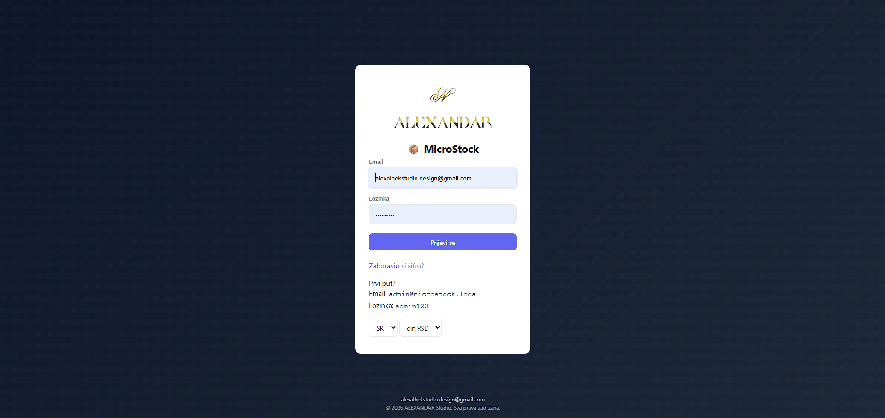

1. Otvori **link** koji si dobio uz nalog (npr. `https://microstock.onrender.com`)
2. Ukucaj **email** i **šifru**
3. Klikni **Prijavi se**

**Prvi put?** Kontaktiraj administratora da ti kreira nalog.

### Promena šifre

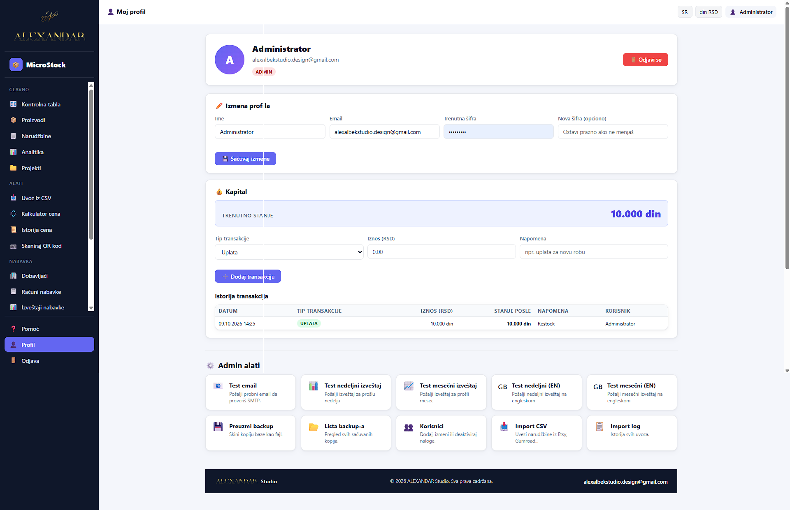

1. Klikni **Profil** u sidebar-u
2. Ukucaj trenutnu šifru
3. Ukucaj novu šifru (bar 6 znakova)
4. Klikni **Sačuvaj izmene**

### Zaboravljena šifra

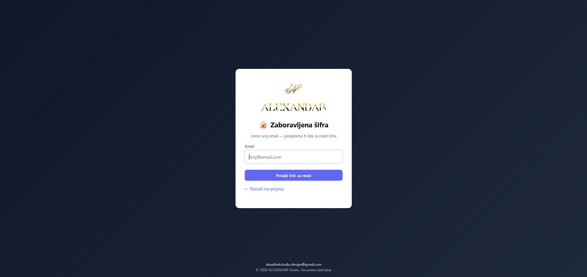

1. Na login stranici klikni **Zaboravio si šifru?**
2. Ukucaj svoj email
3. Dobiješ link za reset (važi 1 sat)
4. Postavi novu šifru

---

## 3. Kontrolna tabla

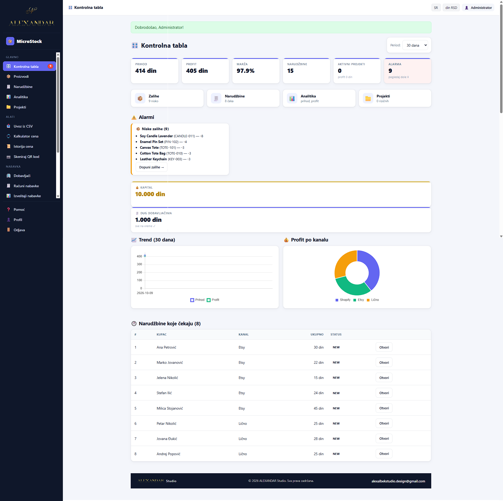

**Kontrolna tabla** je centralno mesto gde vidiš:
- **KPI kartice** — Prihod, Profit, Marža, Narudžbine, Aktivni projekti, Alarmi
- **Kapital** — trenutno stanje
- **Dug dobavljačima** — koliko duguješ
- **Brze akcije** — prečice do Zalihe, Narudžbine, Analitika, Projekti
- **Alarmi** — šta treba danas (niske zalihe, rokovi, gubitaši)
- **Grafikoni** — trend prihoda/profita (30 dana), profit po kanalu

**Filter perioda** — gore desno (7/30/90/365 dana)

### Kapital

**Kapital** je koliko novca imaš na raspolaganju za poslovanje. Menjaš ga kroz:
- **Uplata** — kad ubaciš novac u firmu
- **Isplata** — kad izvadiš novac
- **Kupovina** — kad kupiš robu (auto ili ručno)
- **Prodaja** — kad prodaš robu (auto ili ručno)
- **Korekcija** — ručna korekcija

---

## 4. Proizvodi

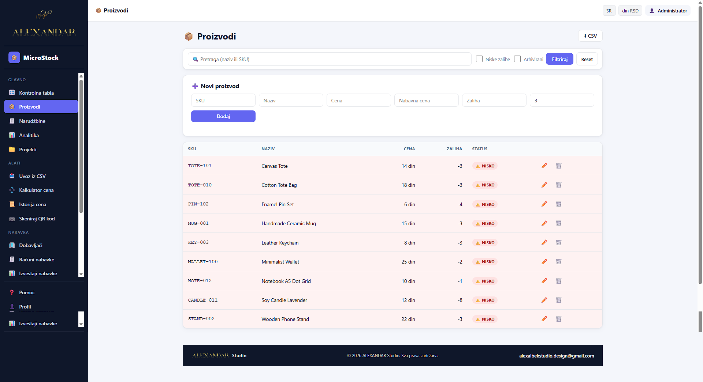

### Dodavanje proizvoda

1. Klikni **Proizvodi** u sidebar-u
2. Klikni **➕ Novi proizvod**
3. Popuni:
   - **SKU** — jedinstvena šifra (npr. `MUG-001`)
   - **Naziv** — ime proizvoda
   - **Cena** — prodajna cena (RSD)
   - **Nabavna cena** — koliko te košta
   - **Zaliha** — trenutna količina
   - **Alarm ispod** — kad da te upozori (npr. 3)
4. Klikni **Sačuvaj**

### Izmena proizvoda

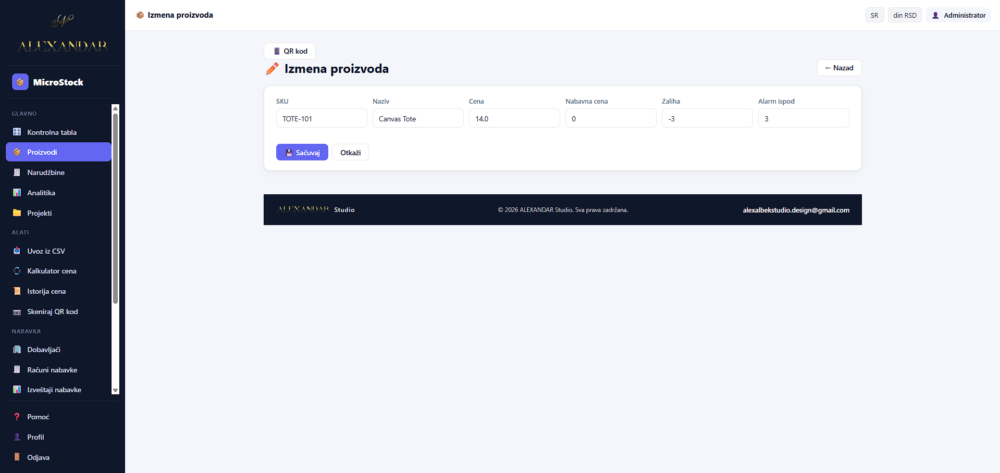

1. Klikni **✏️** pored proizvoda
2. Izmeni polja
3. Klikni **Sačuvaj**

### Arhiviranje

Umesto brisanja — **arhiviraj** proizvod. Ostaje u bazi (zbog istorije narudžbina), ali se ne prikazuje u listi.

### QR kod

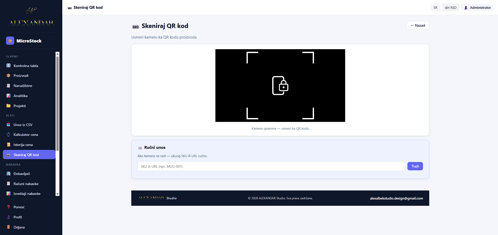

Klikni **📱 QR kod** → skini PNG sa QR kodom. Štampaj i zalepi na policu/proizvod. Skeniraj telefonom → otvara proizvod.

### Export u CSV

Klikni **CSV** → skini sve proizvode u Excel formatu.

---

## 5. Narudžbine

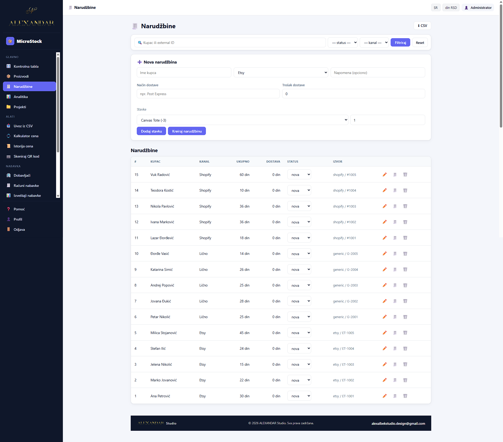

### Kreiranje narudžbine

1. Klikni **Narudžbine** u sidebar-u
2. Klikni **➕ Nova narudžbina**
3. Popuni:
   - **Kupac** — ime kupca
   - **Kanal** — Etsy, Shopify, Instagram...
   - **Stavke** — koji proizvod, koliko komada
   - **Napomena** — opciono
   - **Dostava** — trošak i način
4. Klikni **Kreiraj narudžbinu**

### Status workflow

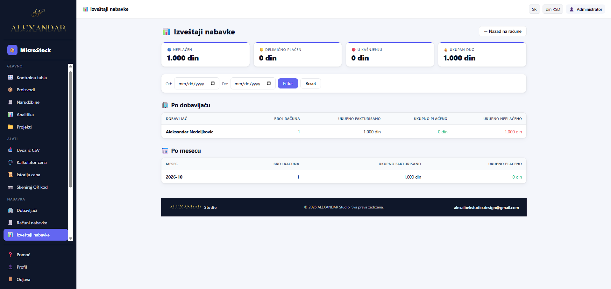

Narudžbina prolazi kroz faze:
- **Nova** → **Plaćena** → **Poslata** → **Završena**
- **Otkazana** (ako kupac odustane)

### PDF faktura

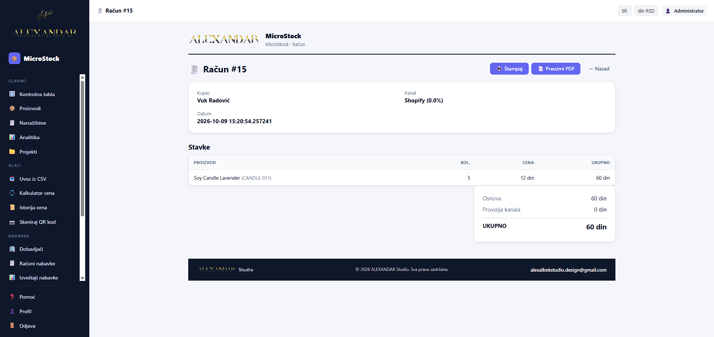

1. Otvori narudžbinu
2. Klikni **📄 Preuzmi PDF**
3. Faktura se skida u **izabranoj valuti** (RSD/EUR/USD)

### Štampa

Klikni **🖨️ Štampaj** → otvara print dijalog u browseru.

---

## 6. Analitika

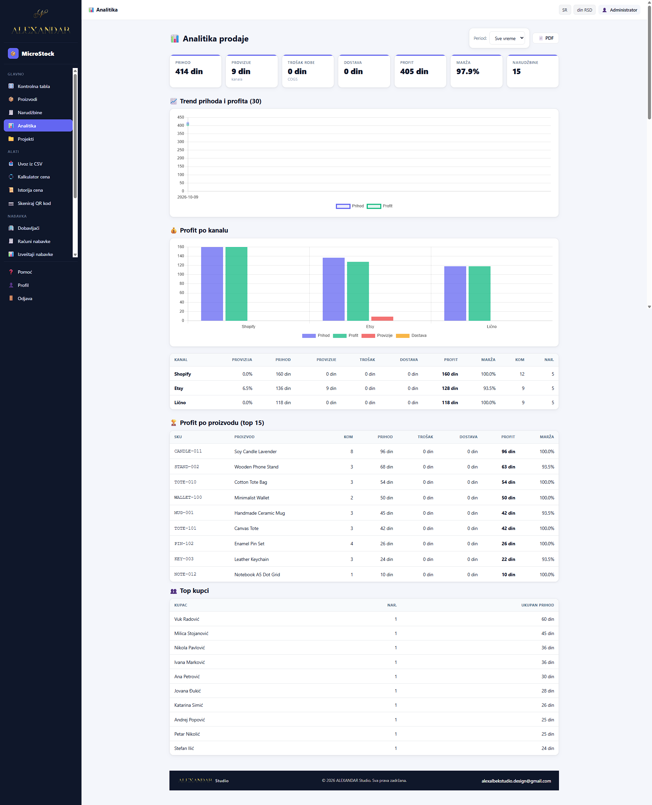

**Analitika** prikazuje:
- **KPI** — Prihod, Provizije, Trošak, Dostava, Profit, Marža
- **Trend** — prihod i profit po danima
- **Profit po kanalu** — koji kanal donosi najviše
- **Top proizvodi** — 15 najprodavanijih
- **Gubitaši** — proizvodi koji se prodaju ispod cene
- **Top kupci** — 10 najboljih

**Filter perioda** — 7/30/90/365 dana ili sve vreme.

### PDF izveštaj

Klikni **📄 PDF** → skini izveštaj analitike sa logom.

---

## 7. Projekti

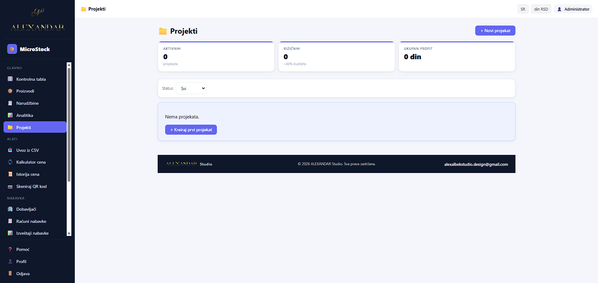

**Projekti** su za agencije/konsultante — prati:
- **Klijent** — kome radiš
- **Ugovorena vrednost** — koliko si naplatio
- **Radni sati** — koliko je tim potrošio
- **Troškovi** — materijal, podizvođači, put
- **Profit** — ugovorena vrednost − troškovi
- **Budget usage** — procenat iskorišćenosti

### Dodavanje projekta

1. Klikni **Projekti** u sidebar-u
2. Klikni **➕ Novi projekat**
3. Popuni osnovne podatke
4. **Sačuvaj**

### Radni sati i troškovi

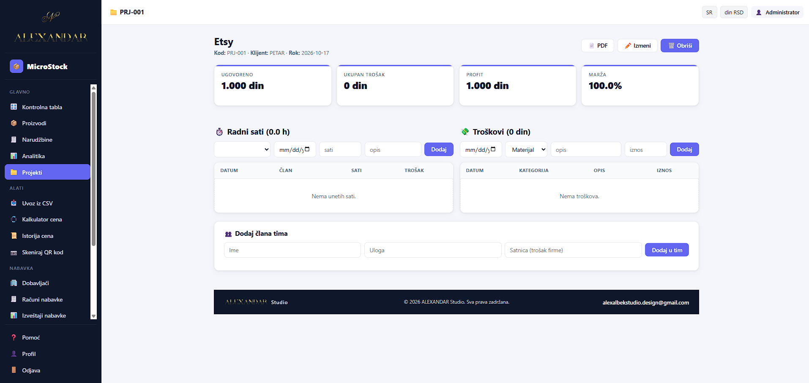

U detaljima projekta dodaješ:
- **Sate** — koji član tima, koliko sati, opis
- **Troškove** — kategorija (materijal, podizvođač, put), iznos, opis

### Alarmi

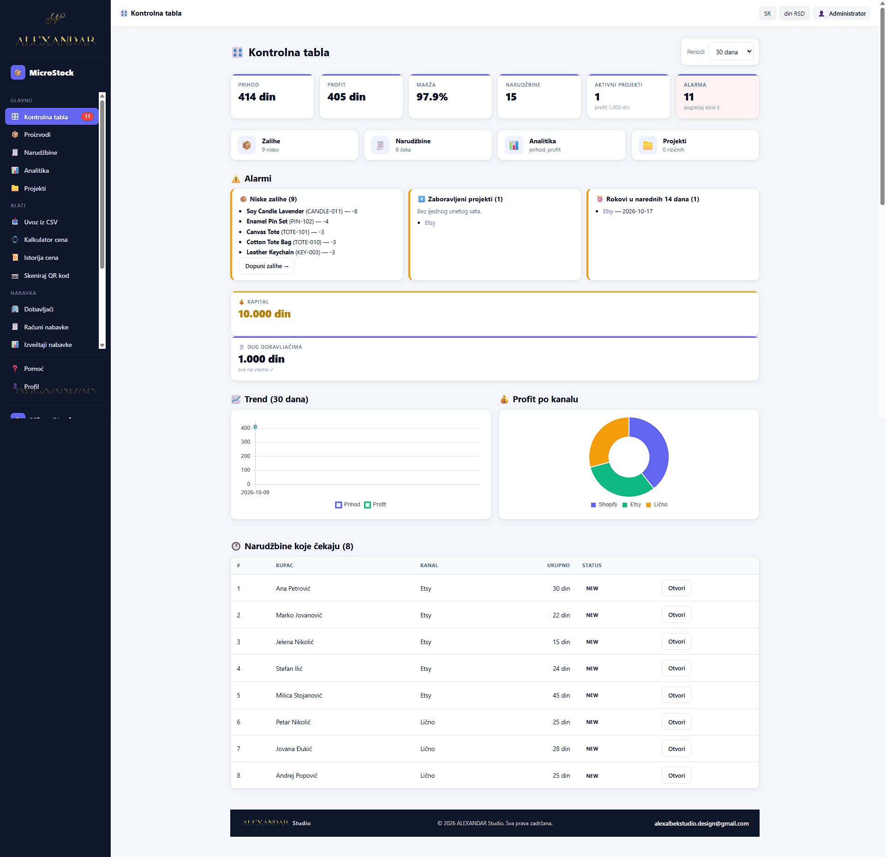

Kad projekat pređe **80% budžeta** → upozorenje (žuto).
Kad pređe **100% budžeta** → alarm (crveno).

### PDF izveštaj projekta

Klikni **📄 PDF** → skini izveštaj sa satima, troškovima i KPI.

---

## 8. Dobavljači i nabavka

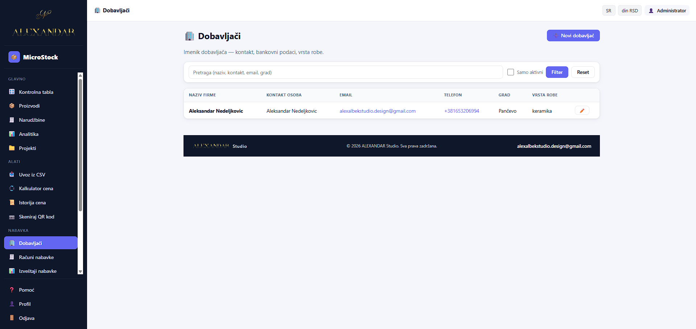

**Dobavljači** je imenik ljudi/firmi od kojih kupuješ robu.

### Dodavanje dobavljača

1. Klikni **Dobavljači** u sidebar-u
2. Klikni **➕ Novi dobavljač**
3. Popuni:
   - **Naziv firme** (obavezno)
   - **Kontakt osoba**, **email**, **telefon**
   - **Adresa**, **grad**, **PIB**
   - **IBAN**, **SWIFT** — za plaćanje
   - **Vrsta robe** — šta od njega kupuješ
4. Klikni **Sačuvaj**

### Računi nabavke

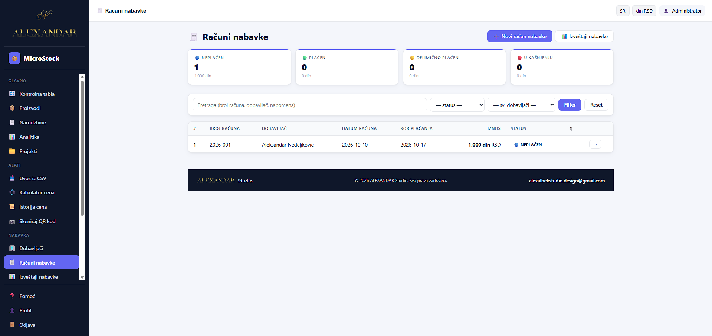

**Računi nabavke** prate šta si kupio, kad, koliko, i da li si platio.

### Novi račun

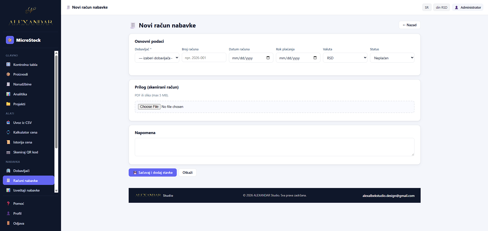

1. Klikni **🧾 Računi nabavke** u sidebar-u
2. Klikni **➕ Novi račun nabavke**
3. Popuni:
   - **Dobavljač** (obavezno)
   - **Broj računa** (opciono)
   - **Datum računa**, **rok plaćanja**
   - **Valuta** (RSD/EUR/USD)
   - **Status** — neplaćen / plaćen / delimično / u kašnjenju
4. **Upload skeniranog računa** (PDF ili slika, max 5 MB)
5. Klikni **Sačuvaj i dodaj stavke**

### Stavke računa

Dodaj svaku stavku:
- **Proizvod** iz baze ili **slobodan tekst** (npr. "materijal za pakovanje")
- **Količina**
- **Cena po komadu**
- **Ukupno** — automatski se računa

### Status plaćanja

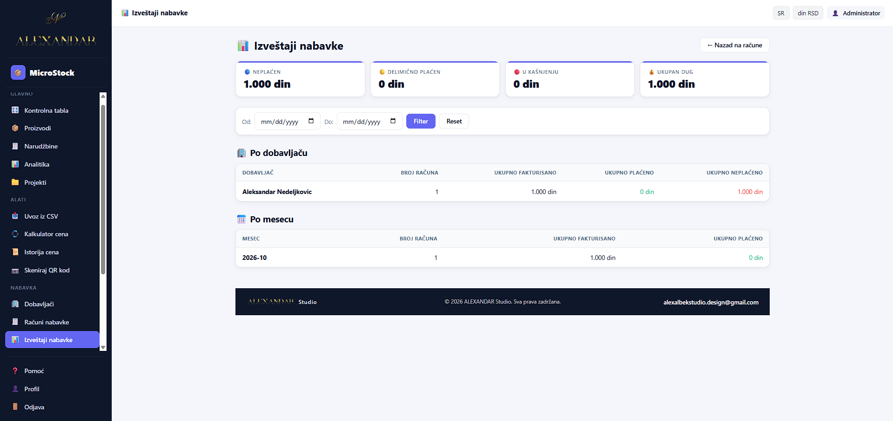

- **Neplaćen** (🔵) — još nisi platio
- **Plaćen** (🟢) — platio si → **auto-odbitak kapitala**
- **Delimično plaćen** (🟡) — platio si deo
- **U kašnjenju** (🔴) — prošao rok
- **Otkazan** (⚫) — otkazano

**Kad označiš "Plaćen":**
- Kapital se automatski smanjuje za iznos
- Nabavna cena proizvoda se ažurira (prosečna)

### Izveštaji nabavke

Klikni **📊 Izveštaji nabavke** → vidiš:
- Ukupan dug dobavljačima
- Po dobavljaču — koliko si platio, koliko duguješ
- Po mesecu — koliko si platio svakog meseca

---

## 9. Kapital

**Kapital** je novac na raspolaganju za poslovanje.

### Transakcije

- **Uplata** — ubacuješ novac u firmu
- **Isplata** — vadiš novac (plata, lično)
- **Kupovina** — kupovina robe (smanjuje)
- **Prodaja** — prodaja robe (povećava)
- **Korekcija** — ručna korekcija

**Automatski:**
- Kad označiš račun nabavke kao **plaćen** → kapital se smanjuje
- Kad storniraš → kapital se vraća

---

## 10. Kalkulator cena

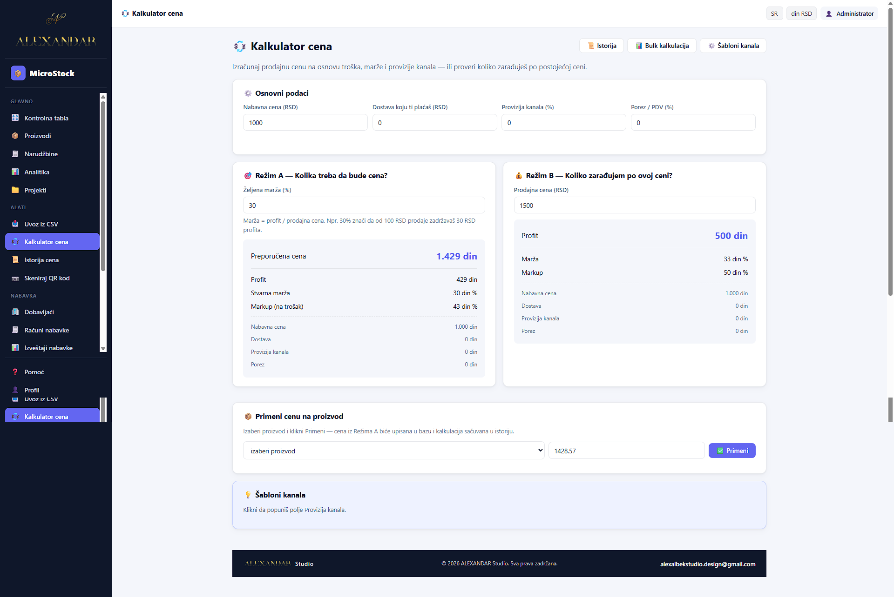

**Kalkulator cena** pomaže da odrediš **prodajnu cenu**.

### Režim A — Kolika treba da bude cena?

1. Ukucaj **nabavnu cenu**
2. Ukucaj **dostavu** (ako je plaćaš ti)
3. Ukucaj **proviziju kanala** (npr. Etsy 6.5%)
4. Ukucaj **željenu maržu** (npr. 30%)
5. Vidiš **preporučenu cenu**, **profit**, **stvarnu maržu**

### Režim B — Koliko zarađujem po ovoj ceni?

1. Ukucaj **nabavnu cenu**
2. Ukucaj **prodajnu cenu**
3. Vidiš **profit**, **maržu**, **markup**

### Primeni na proizvod

Izaberi proizvod → klikni **Primeni** → nova cena se čuva u bazu.

---

## 11. Uvoz iz CSV

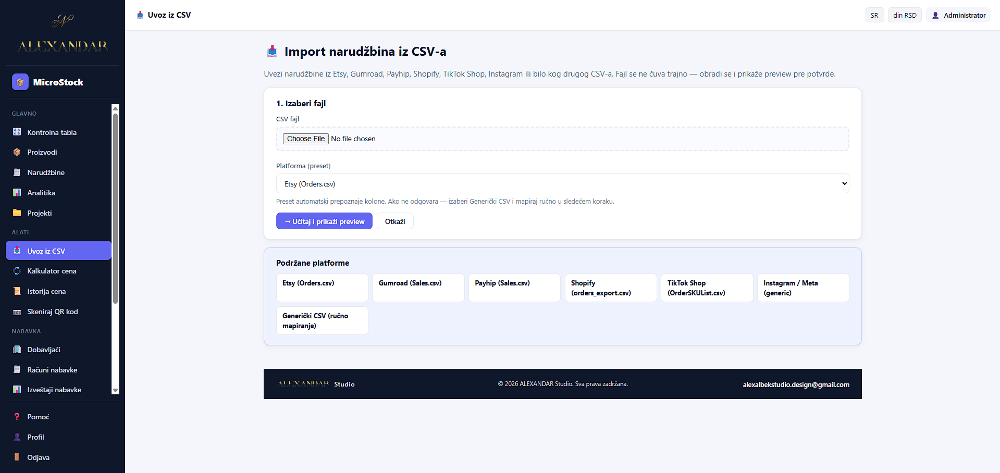

**Uvoz iz CSV** omogućava masovni unos narudžbina.

### Podržane platforme

- Etsy (Orders.csv)
- Shopify (orders_export.csv)
- Gumroad
- Payhip
- TikTok Shop
- Instagram / Meta
- **Generički CSV** — ručno mapiranje

### Postupak

1. Klikni **📥 Uvoz iz CSV**
2. Izaberi **fajl**
3. Izaberi **platformu** (preset)
4. Klikni **→ Učitaj i prikaži preview**
5. **Proveri mapiranje kolona** — ako nešto nije dobro, promeni ručno
6. Izaberi **kanal** (Etsy, Shopify...)
7. Klikni **✅ Potvrdi i uvezi**

### Rezultat

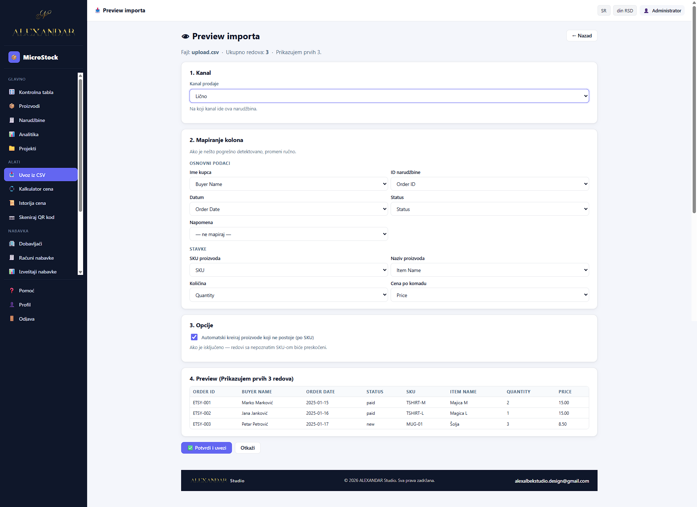

Vidiš:
- **Ukupno redova**
- **Uvezeno** — koliko narudžbina
- **Preskočeno** — duplikati
- **Greške** — ako ima
- **Novi proizvodi** — automatski kreirani

---

## 12. QR skener

**QR skener** omogućava brzo otvaranje proizvoda skeniranjem QR koda.

### Postupak

1. Klikni **📷 Skeniraj QR kod** u sidebar-u
2. Dozvoli **kameru** u browseru
3. Usmeri kameru ka QR kodu
4. Kad skenira — otvara **modal** sa proizvodom (naziv, cena, zaliha)
5. Klikni **➕ Dodaj u narudžbinu** → popuni formu → **Kreiraj**

### Ručni unos

Ako kamera ne radi, ukucaj **SKU** ili **URL** u polje **Ručni unos**.

---

## 13. Podešavanja

### Jezik

U topbar-u (gore desno) izaberi **SR** ili **EN**.

### Valuta

U topbar-u izaberi **din RSD**, **€ EUR** ili **$ USD**. Sve cene se automatski konvertuju.

### Kurs (admin)

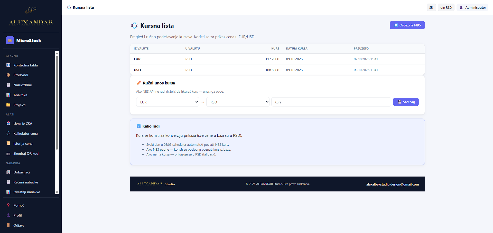

Admin može da:
- Vidi trenutne kurseve
- **Ručno unese** kurs (ako NBS padne)
- **Osveži iz NBS** (jednim klikom)

### Korisnici (admin)

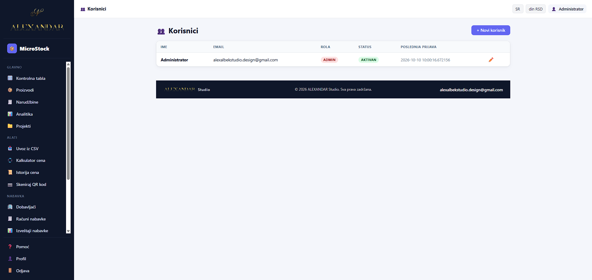

Admin može da:
- Dodaje nove korisnike
- Menja role (admin/manager/viewer)
- Aktivira/deaktivira naloge
- Menja šifre

### Bekapovi (admin)

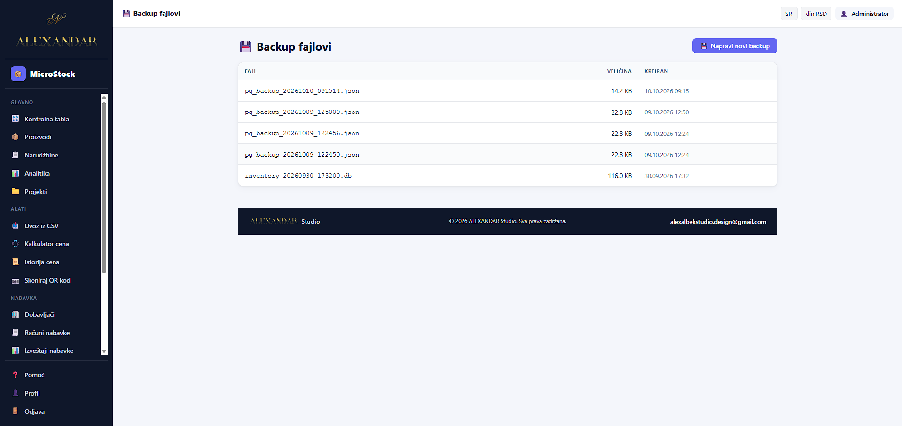

Klikni **💾 Bekapovi** → skini JSON bekap baze.

---

## 14. Podrška

**Email:** [alexalbekstudio.design@gmail.com](mailto:alexalbekstudio.design@gmail.com)
**Studio:** ALEXANDAR Studio
**Copyright:** © 2026 ALEXANDAR Studio

---

*Hvala što koristiš MicroStock!*