# MicroStock — User Guide

**Version:** 1.0
**Date:** October 2026
**Author:** ALEXANDAR Studio

---

## Table of Contents

1. [Introduction](#1-introduction)
2. [First Login](#2-first-login)
3. [Dashboard](#3-dashboard)
4. [Products](#4-products)
5. [Orders](#5-orders)
6. [Analytics](#6-analytics)
7. [Projects](#7-projects)
8. [Suppliers & Purchases](#8-suppliers--purchases)
9. [Capital](#9-capital)
10. [Pricing Calculator](#10-pricing-calculator)
11. [CSV Import](#11-csv-import)
12. [QR Scanner](#12-qr-scanner)
13. [Settings](#13-settings)
14. [Support](#14-support)

---

## 1. Introduction

MicroStock is a **lightweight web tool** for managing a small online business. It's designed for:
- **Small online sellers** (Instagram, WhatsApp, Etsy, Shopify, Faire)
- **Small agencies and consultants** who track projects and costs

**Key advantages:**
- Everything in one place (stock, orders, projects, finances)
- Runs in the browser — no installation
- PWA — installs as an app on phone
- Multi-currency and bilingual

---

## 2. First Login

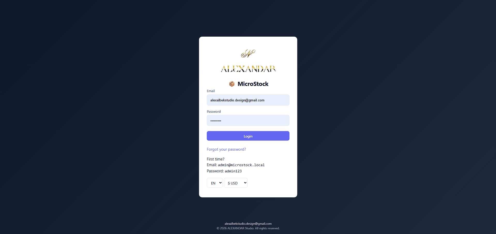

1. Open the **link** you received with your account (e.g. `https://microstock.onrender.com`)
2. Enter **email** and **password**
3. Click **Login**

**First time?** Contact the administrator to create your account.

### Change Password

1. Click **Profile** in the sidebar
2. Enter current password
3. Enter new password (min 6 characters)
4. Click **Save changes**

### Forgot Password

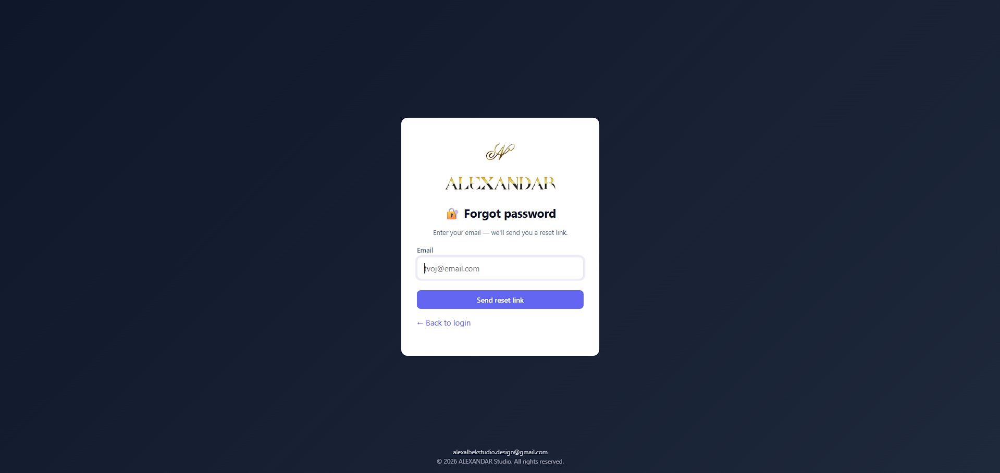

1. On the login page, click **Forgot your password?**
2. Enter your email
3. You'll receive a reset link (valid 1 hour)
4. Set new password

---

## 3. Dashboard

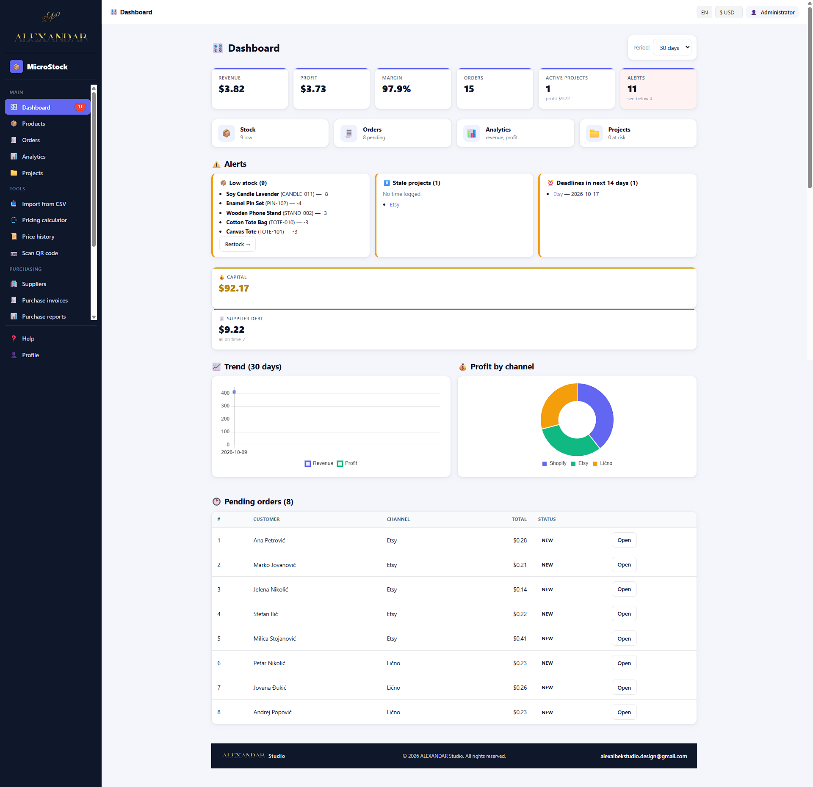

**Dashboard** is the central place where you see:
- **KPI cards** — Revenue, Profit, Margin, Orders, Active Projects, Alerts
- **Capital** — current balance
- **Supplier debt** — how much you owe
- **Quick actions** — shortcuts to Stock, Orders, Analytics, Projects
- **Alerts** — what to do today (low stock, deadlines, loss-makers)
- **Charts** — revenue/profit trend (30 days), profit by channel

**Period filter** — top right (7/30/90/365 days)

### Capital

**Capital** is how much money you have available for business. You change it through:
- **Deposit** — when you put money into the company
- **Withdrawal** — when you take money out
- **Purchase** — when you buy goods (auto or manual)
- **Sale** — when you sell goods (auto or manual)
- **Adjustment** — manual correction

---

## 4. Products

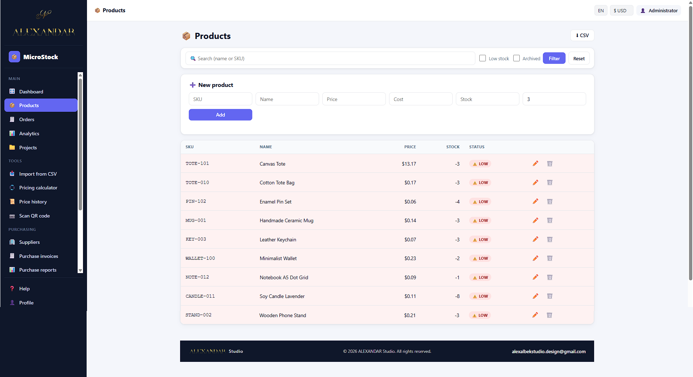

### Add Product

1. Click **Products** in the sidebar
2. Click **➕ New product**
3. Fill in:
   - **SKU** — unique code (e.g. `MUG-001`)
   - **Name** — product name
   - **Price** — selling price (RSD)
   - **Cost** — purchase cost
   - **Stock** — current quantity
   - **Alert below** — when to warn you (e.g. 3)
4. Click **Save**

### Edit Product

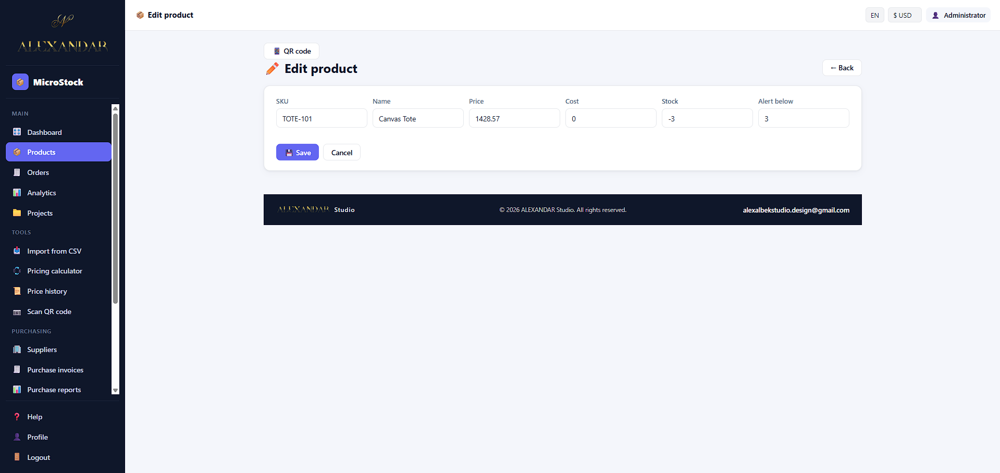

1. Click **✏️** next to the product
2. Modify fields
3. Click **Save**

### Archive

Instead of deleting — **archive** the product. It stays in the database (for order history), but doesn't appear in the list.

### QR Code

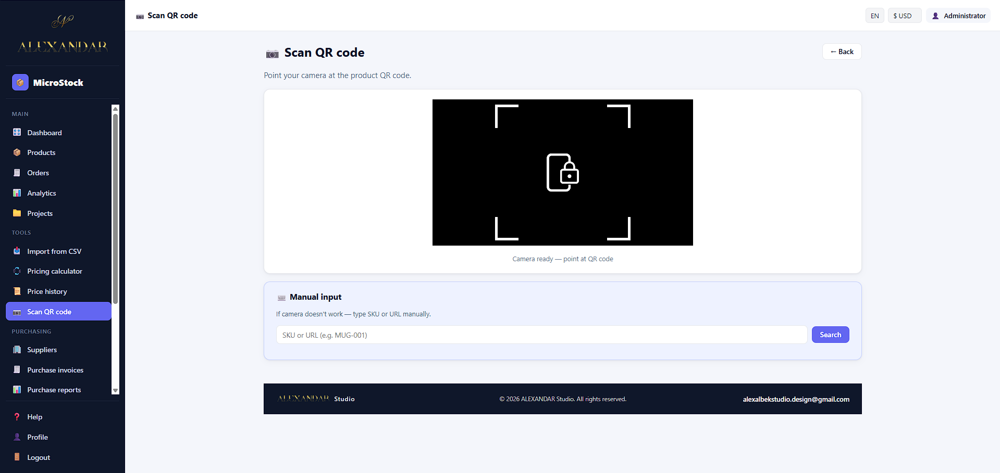

Click **📱 QR code** → download PNG with QR code. Print and stick on shelf/product. Scan with phone → opens product.

### CSV Export

Click **CSV** → download all products in Excel format.

---

## 5. Orders

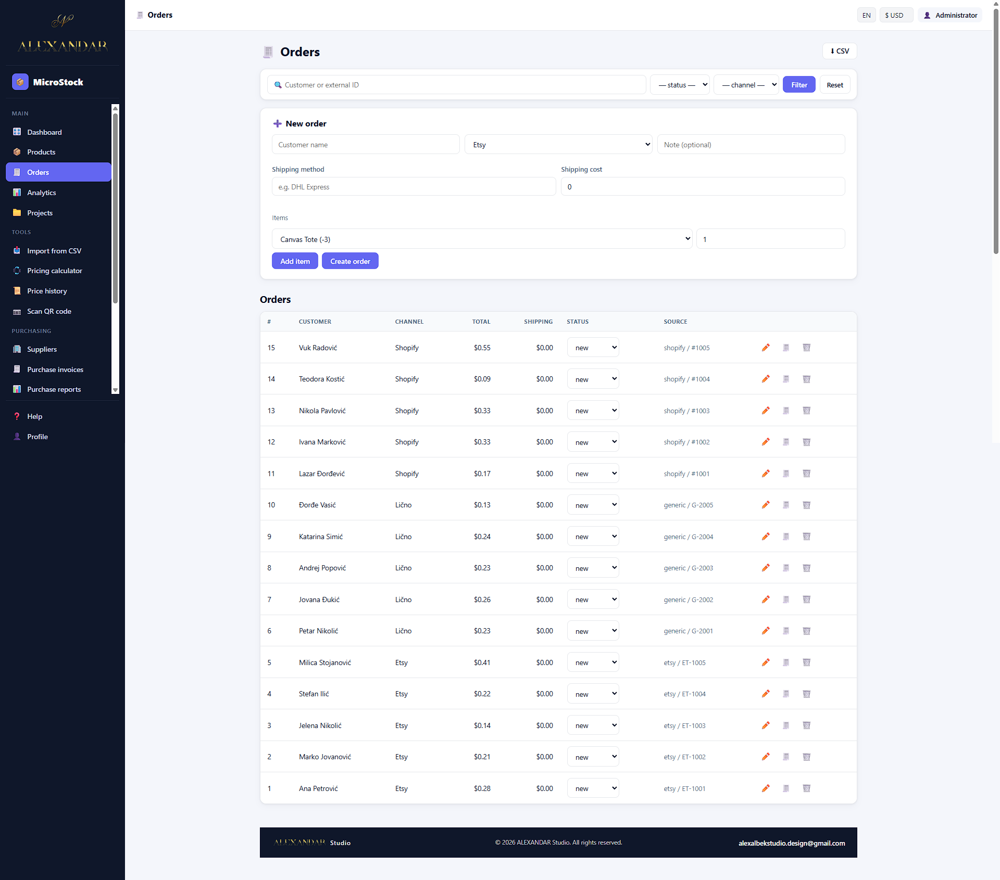

### Create Order

1. Click **Orders** in the sidebar
2. Click **➕ New order**
3. Fill in:
   - **Customer** — customer name
   - **Channel** — Etsy, Shopify, Instagram...
   - **Items** — which product, how many
   - **Note** — optional
   - **Shipping** — cost and method
4. Click **Create order**

### Status Workflow

Order goes through phases:
- **New** → **Paid** → **Shipped** → **Done**
- **Cancelled** (if customer cancels)

### PDF Invoice

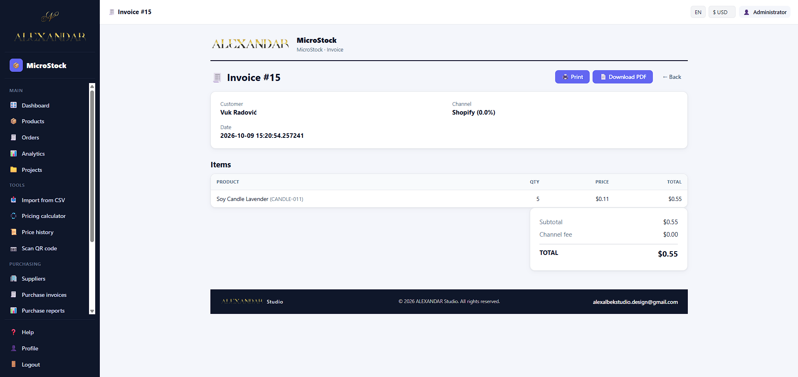

1. Open order
2. Click **📄 Download PDF**
3. Invoice downloads in **selected currency** (RSD/EUR/USD)

### Print

Click **🖨️ Print** → opens print dialog in browser.

---

## 6. Analytics

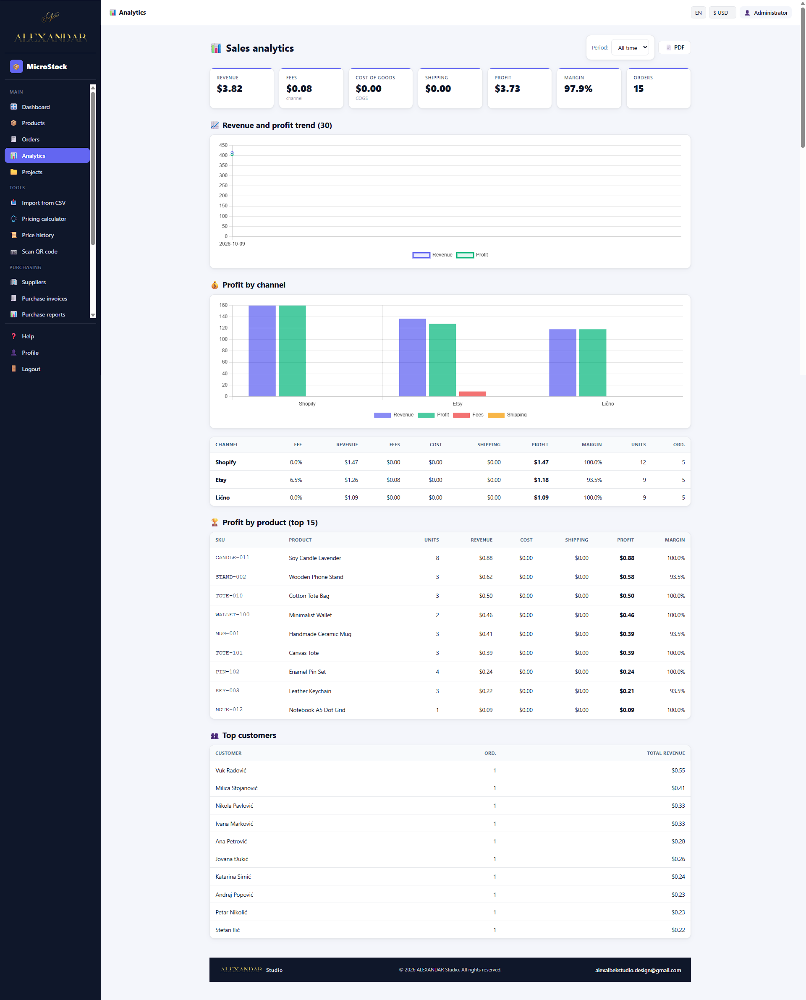

**Analytics** shows:
- **KPI** — Revenue, Fees, Cost, Shipping, Profit, Margin
- **Trend** — revenue and profit by day
- **Profit by channel** — which channel brings the most
- **Top products** — 15 best sellers
- **Loss-makers** — products sold below cost
- **Top customers** — 10 best

**Period filter** — 7/30/90/365 days or all time.

### PDF Report

Click **📄 PDF** → download analytics report with logo.

---

## 7. Projects

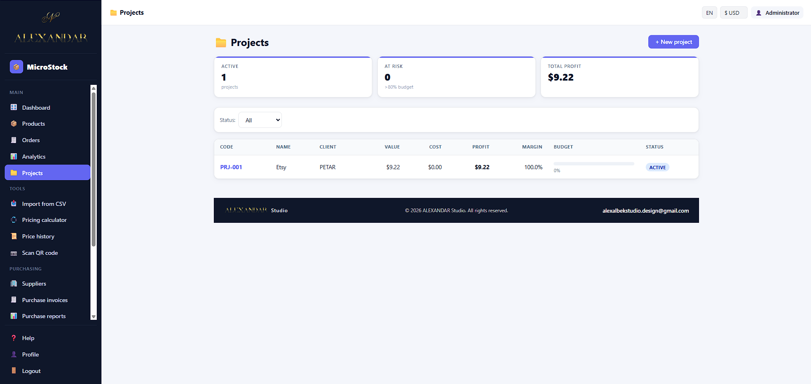

**Projects** are for agencies/consultants — track:
- **Client** — who you work for
- **Contract value** — how much you charged
- **Work hours** — how much the team spent
- **Expenses** — material, subcontractors, travel
- **Profit** — contract value − costs
- **Budget usage** — percentage of usage

### Add Project

1. Click **Projects** in the sidebar
2. Click **➕ New project**
3. Fill in basic data
4. **Save**

### Work Hours and Expenses

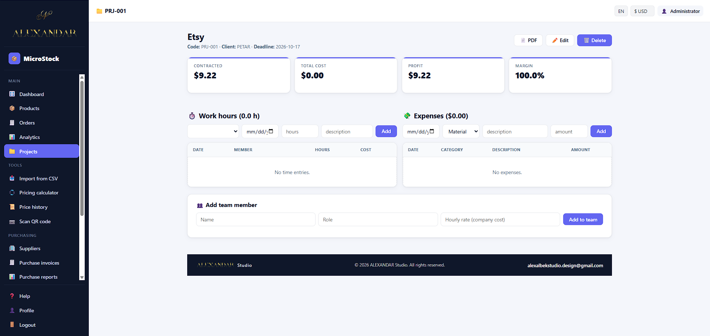

In project details, add:
- **Hours** — which team member, how many hours, description
- **Expenses** — category (material, subcontractor, travel), amount, description

### Alerts

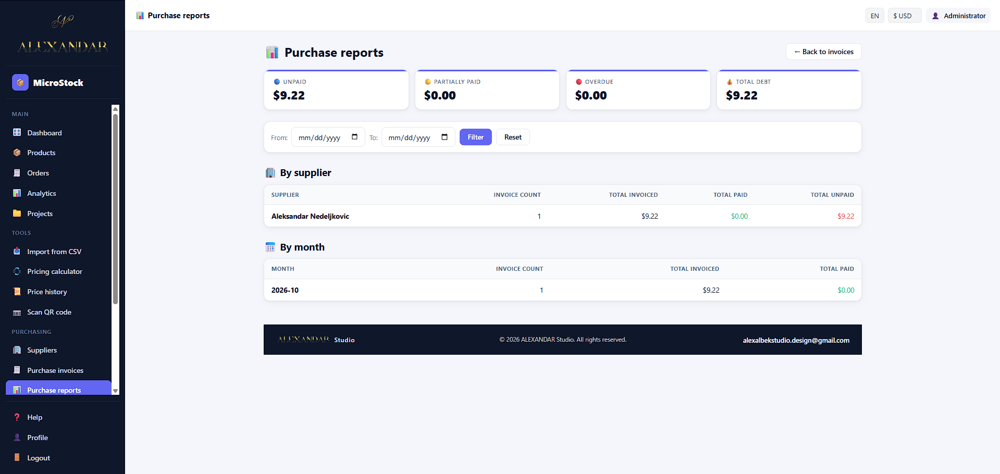

When project exceeds **80% budget** → warning (yellow).
When it exceeds **100% budget** → alarm (red).

### Project PDF Report

Click **📄 PDF** → download report with hours, expenses, and KPI.

---

## 8. Suppliers & Purchases

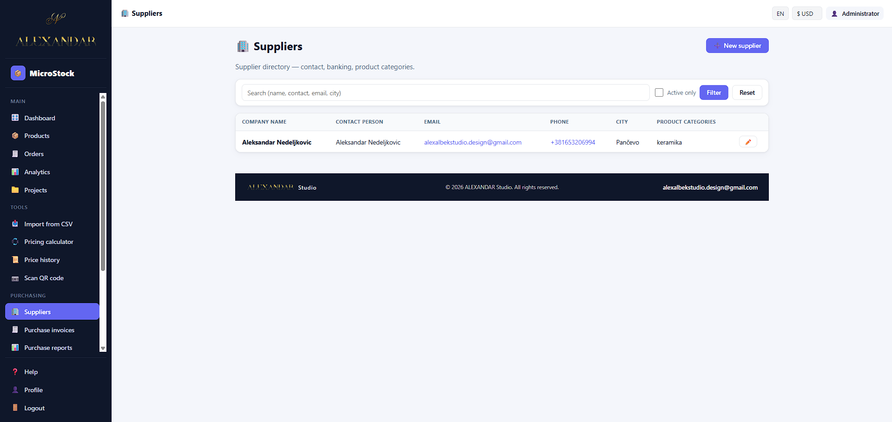

**Suppliers** is a directory of people/companies you buy goods from.

### Add Supplier

1. Click **Suppliers** in the sidebar
2. Click **➕ New supplier**
3. Fill in:
   - **Company name** (required)
   - **Contact person**, **email**, **phone**
   - **Address**, **city**, **Tax ID**
   - **IBAN**, **SWIFT** — for payment
   - **Product categories** — what you buy from them
4. Click **Save**

### Purchase Invoices

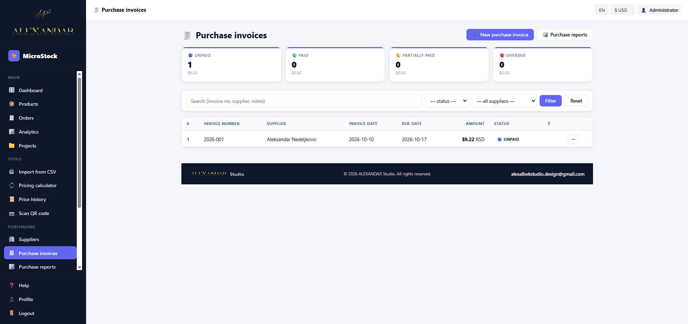

**Purchase invoices** track what you bought, when, how much, and if you paid.

### New Invoice

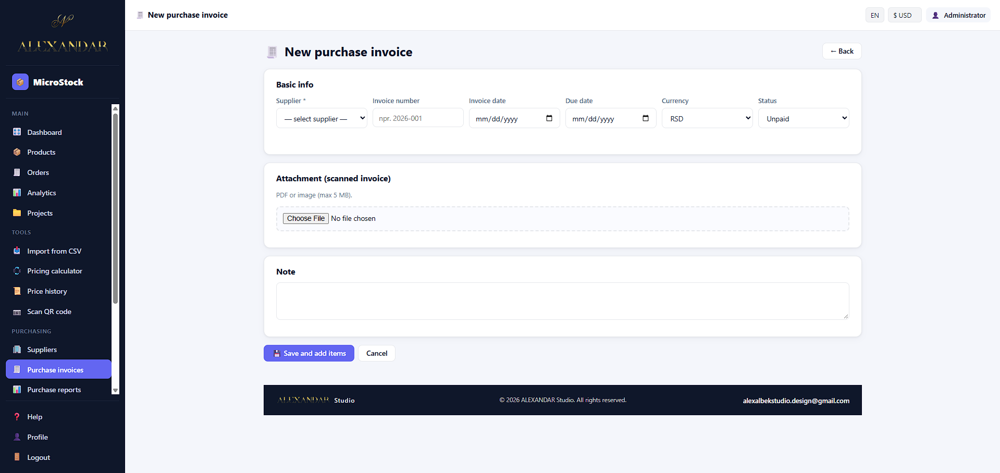

1. Click **🧾 Purchase invoices** in the sidebar
2. Click **➕ New purchase invoice**
3. Fill in:
   - **Supplier** (required)
   - **Invoice number** (optional)
   - **Invoice date**, **due date**
   - **Currency** (RSD/EUR/USD)
   - **Status** — unpaid / paid / partial / overdue
4. **Upload scanned invoice** (PDF or image, max 5 MB)
5. Click **Save and add items**

### Invoice Items

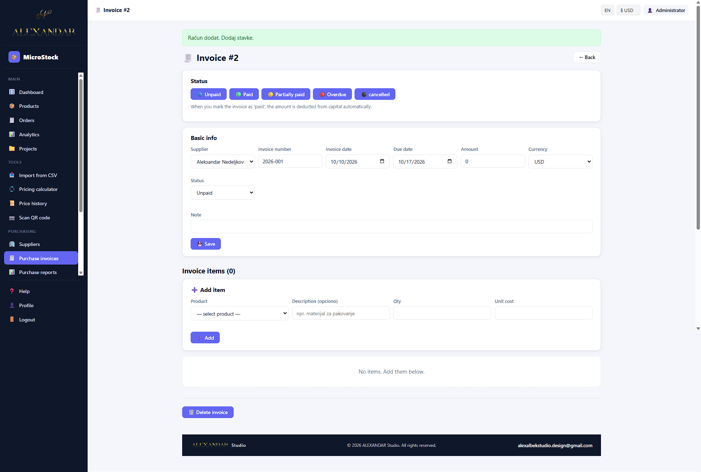

Add each item:
- **Product** from database or **free text** (e.g. "packaging material")
- **Quantity**
- **Unit cost**
- **Total** — auto-calculated

### Payment Status

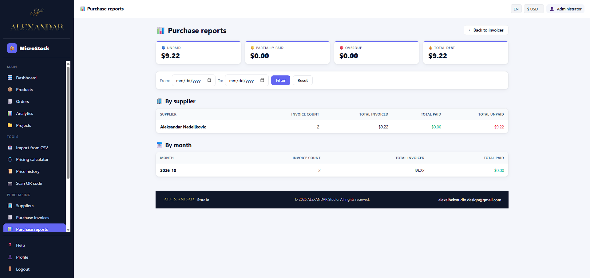

- **Unpaid** (🔵) — not yet paid
- **Paid** (🟢) — paid → **auto-deduct capital**
- **Partial** (🟡) — paid part
- **Overdue** (🔴) — past due date
- **Cancelled** (⚫) — cancelled

**When you mark "Paid":**
- Capital is automatically reduced by the amount
- Product cost is updated (average)

### Purchase Reports

Click **📊 Purchase reports** → see:
- Total debt to suppliers
- By supplier — how much you paid, how much you owe
- By month — how much you paid each month

---

## 9. Capital

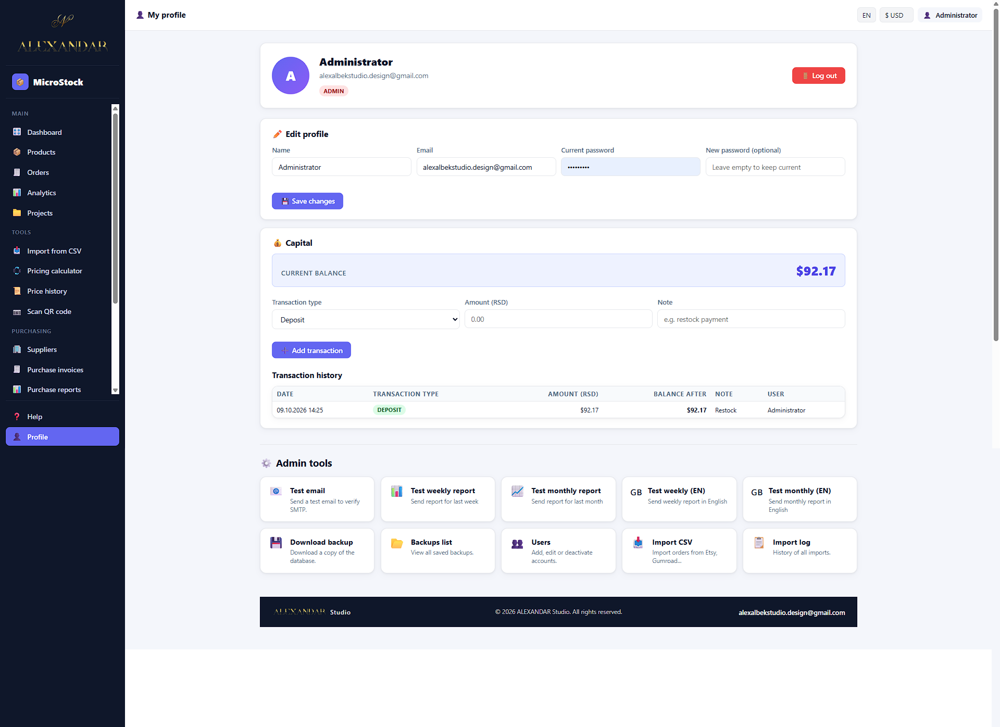

**Capital** is money available for business.

### Transactions

- **Deposit** — put money into company
- **Withdrawal** — take money out (salary, personal)
- **Purchase** — buy goods (reduces)
- **Sale** — sell goods (increases)
- **Adjustment** — manual correction

**Automatic:**
- When you mark purchase invoice as **paid** → capital is reduced
- When you cancel → capital is returned

---

## 10. Pricing Calculator

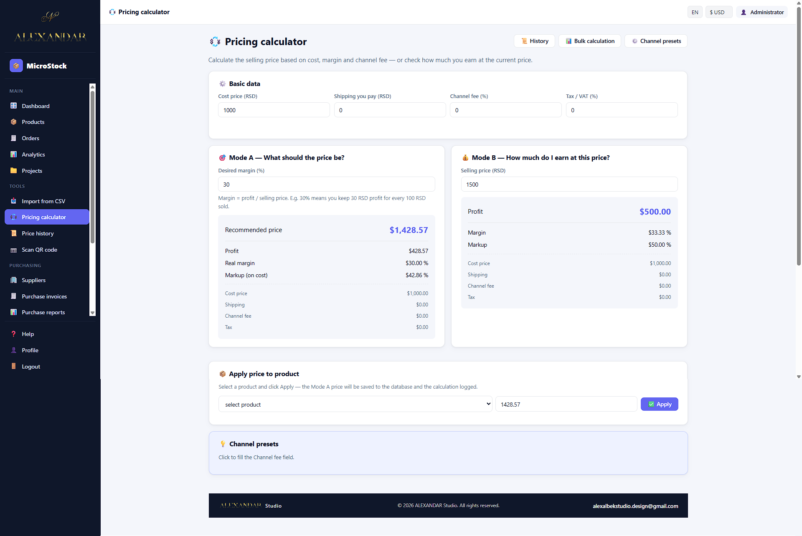

**Pricing calculator** helps determine **selling price**.

### Mode A — What should the price be?

1. Enter **cost price**
2. Enter **shipping** (if you pay it)
3. Enter **channel fee** (e.g. Etsy 6.5%)
4. Enter **desired margin** (e.g. 30%)
5. See **recommended price**, **profit**, **real margin**

### Mode B — How much do I earn at this price?

1. Enter **cost price**
2. Enter **selling price**
3. See **profit**, **margin**, **markup**

### Apply to Product

Select product → click **Apply** → new price is saved to database.

---

## 11. CSV Import

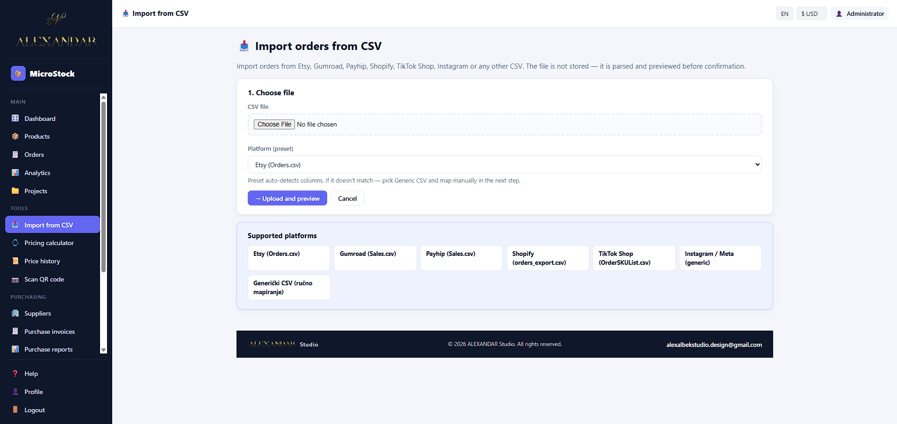

**CSV Import** allows bulk entry of orders.

### Supported Platforms

- Etsy (Orders.csv)
- Shopify (orders_export.csv)
- Gumroad
- Payhip
- TikTok Shop
- Instagram / Meta
- **Generic CSV** — manual mapping

### Procedure

1. Click **📥 Import from CSV**
2. Select **file**
3. Select **platform** (preset)
4. Click **→ Upload and preview**
5. **Check column mapping** — if something is wrong, change manually
6. Select **channel** (Etsy, Shopify...)
7. Click **✅ Confirm and import**

### Result

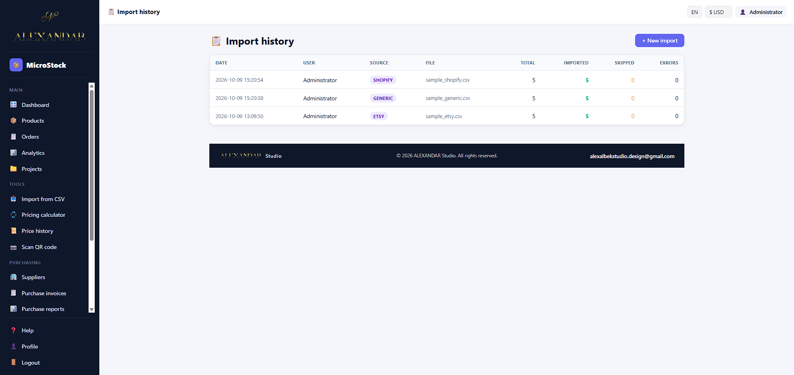

You see:
- **Total rows**
- **Imported** — how many orders
- **Skipped** — duplicates
- **Errors** — if any
- **New products** — auto-created

---

## 12. QR Scanner

**QR scanner** enables quick opening of products by scanning QR code.

### Procedure

1. Click **📷 Scan QR code** in the sidebar
2. Allow **camera** in browser
3. Point camera at QR code
4. When scanned — opens **modal** with product (name, price, stock)
5. Click **➕ Add to order** → fill form → **Create**

### Manual Input

If camera doesn't work, type **SKU** or **URL** in **Manual input** field.

---

## 13. Settings

### Language

In topbar (top right) select **SR** or **EN**.

### Currency

In topbar select **din RSD**, **€ EUR** or **$ USD**. All prices are automatically converted.

### Currency Rates (admin)

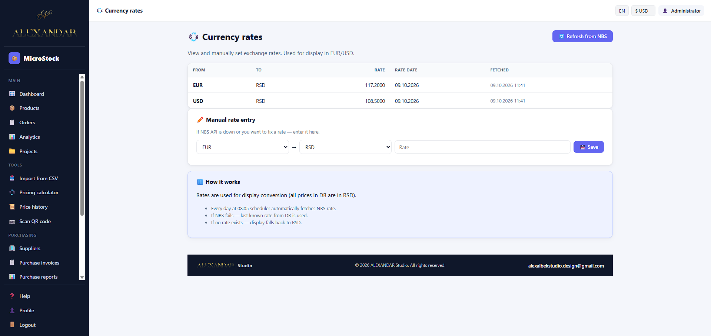

Admin can:
- View current rates
- **Manually enter** rate (if NBS fails)
- **Refresh from NBS** (one click)

### Users (admin)

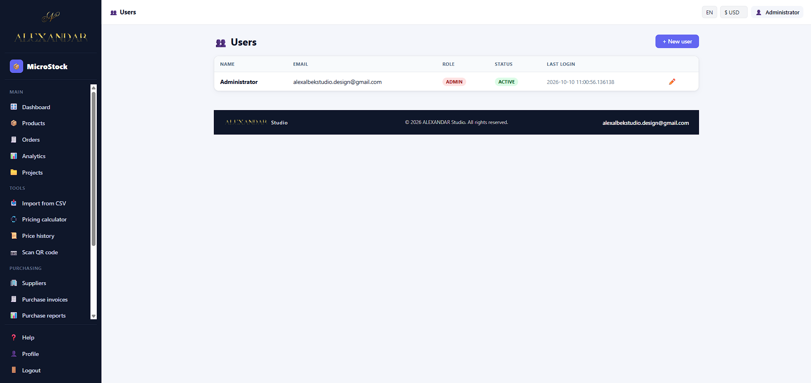

Admin can:
- Add new users
- Change roles (admin/manager/viewer)
- Activate/deactivate accounts
- Change passwords

### Backups (admin)

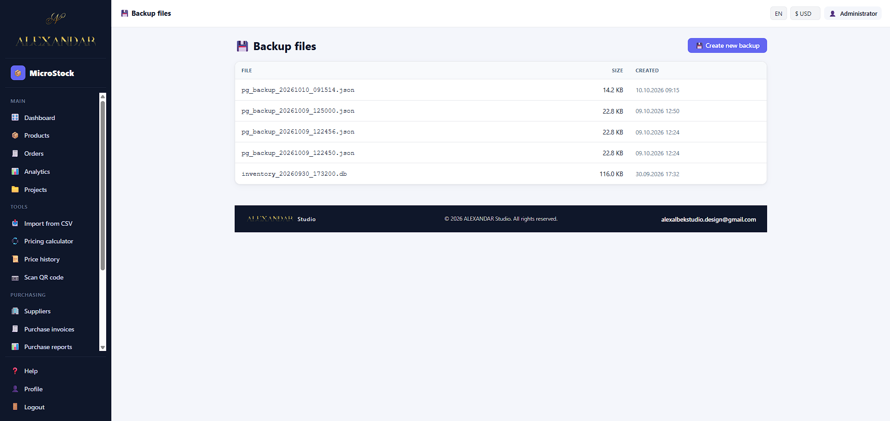

Click **💾 Backups** → download JSON backup of database.

---

## 14. Support

**Email:** [alexalbekstudio.design@gmail.com](mailto:alexalbekstudio.design@gmail.com)
**Studio:** ALEXANDAR Studio
**Copyright:** © 2026 ALEXANDAR Studio

---

*Thank you for using MicroStock!*